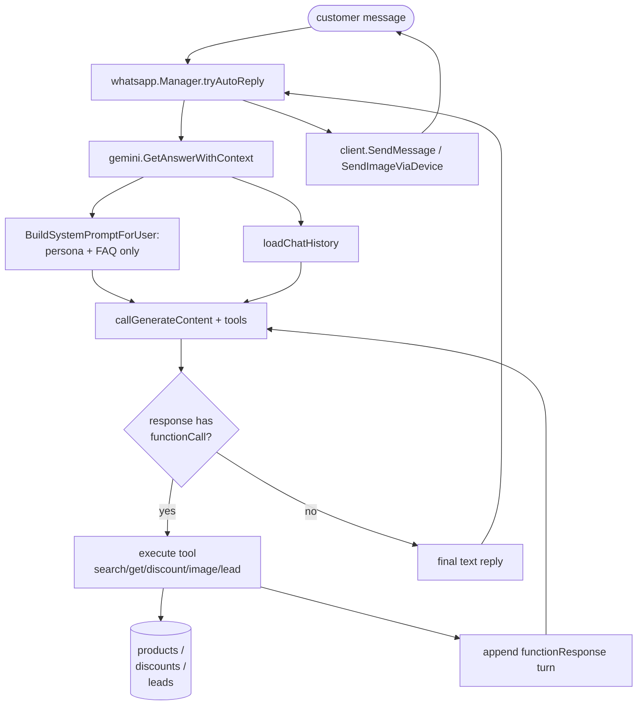

## Scope

End state: a per-tenant AI sales associate that talks like a human on WhatsApp/Facebook, never invents product details, can show product photos, remembers returning customers, and writes leads back into the dashboard for human follow-up.

Code-level changes are concentrated in:

- [`backend/internal/models/models.go`](backend/internal/models/models.go) — new tables.
- [`backend/internal/database/database.go`](backend/internal/database/database.go) — `AutoMigrate` registration.
- [`backend/internal/gemini/gemini.go`](backend/internal/gemini/gemini.go) — tool-calling loop, prompt assembly.
- [`backend/internal/gemini/tools.go`](backend/internal/gemini/tools.go) — **new file**, tool declarations + executors.
- [`backend/internal/handlers/products.go`](backend/internal/handlers/products.go) — **new file**, REST CRUD + CSV import.
- [`backend/internal/whatsapp/manager.go`](backend/internal/whatsapp/manager.go) — `SendImageViaDevice` + `tryAutoReply` no longer needs to know about products (delegated to tools).
- Frontend: a `Products` admin page (CRUD + CSV import + image upload).

The existing auto-reply guards (`autoReplyInFlight`, re-think loop, `humanRepliedAfter`) shipped by [`polish_ai_auto-reply_guards`](.cursor/plans/polish_ai_auto-reply_guards_fd79acff.plan.md) remain unchanged — this plan plugs into them, it does not replace them.

## Design

### High-level flow



The loop on the right is the **only** new control flow — everything to the left of `Call` already exists.

### 1. Data model (PR-1)

Add to [`models/models.go`](backend/internal/models/models.go):

```go
type Product struct {
    ID          uint           `gorm:"primaryKey" json:"id"`
    UserID      uint           `gorm:"not null;index" json:"user_id"`
    SKU         string         `gorm:"size:100;not null;index:idx_user_sku,unique,composite:user_id" json:"sku"`
    Name        string         `gorm:"size:255;not null" json:"name"`
    Description string         `gorm:"type:text" json:"description"`
    Price       float64        `gorm:"type:numeric(12,2);not null" json:"price"`
    Currency    string         `gorm:"size:8;default:'USD'" json:"currency"`
    Stock       int            `gorm:"default:0" json:"stock"`
    Category    string         `gorm:"size:100;index" json:"category"`
    Tags        string         `gorm:"type:text" json:"tags"`
    Active      bool           `gorm:"default:true;index" json:"active"`
    CreatedAt   time.Time      `json:"created_at"`
    UpdatedAt   time.Time      `json:"updated_at"`
    DeletedAt   gorm.DeletedAt `gorm:"index" json:"-"`
    Images      []ProductImage `gorm:"foreignKey:ProductID" json:"images,omitempty"`
}

type ProductImage struct {
    ID        uint   `gorm:"primaryKey" json:"id"`
    ProductID uint   `gorm:"not null;index" json:"product_id"`
    URL       string `gorm:"type:text;not null" json:"url"`
    IsPrimary bool   `gorm:"default:false" json:"is_primary"`
    SortOrder int    `gorm:"default:0" json:"sort_order"`
}

type Discount struct {
    ID        uint       `gorm:"primaryKey" json:"id"`
    UserID    uint       `gorm:"not null;index" json:"user_id"`
    ProductID *uint      `gorm:"index" json:"product_id"`
    Category  string     `gorm:"size:100;index" json:"category"`
    Type      string     `gorm:"size:20" json:"type"`   // 'percent' | 'fixed' | 'bogo'
    Value     float64    `json:"value"`
    Code      string     `gorm:"size:50;index" json:"code,omitempty"`
    StartsAt  *time.Time `json:"starts_at"`
    EndsAt    *time.Time `json:"ends_at"`
    Active    bool       `gorm:"default:true;index" json:"active"`
}
```

PR-4 adds:

```go
type CustomerProfile struct {
    ID            uint      `gorm:"primaryKey"`
    UserID        uint      `gorm:"index;uniqueIndex:idx_user_phone,priority:1"`
    CustomerPhone string    `gorm:"size:50;uniqueIndex:idx_user_phone,priority:2"`
    PreferredLang string    `gorm:"size:10"`
    Interests     string    `gorm:"type:text"` // JSON array
    LastViewedSKU string    `gorm:"size:100"`
    LeadStage     string    `gorm:"size:20"`   // 'cold'|'warm'|'hot'|'won'|'lost'
    Notes         string    `gorm:"type:text"`
    UpdatedAt     time.Time
}

type Lead struct {
    ID         uint      `gorm:"primaryKey"`
    UserID     uint      `gorm:"index"`
    SessionID  uint      `gorm:"index"`
    SKU        string    `gorm:"size:100"`
    Quantity   int
    Notes      string    `gorm:"type:text"`
    CreatedAt  time.Time
}
```

Register them in [`database.Migrate`](backend/internal/database/database.go) lines 50–61 by appending to the `AutoMigrate` call.

### 2. Tool calling (PR-2)

**New file**: `backend/internal/gemini/tools.go`.

```go
package gemini

type toolDef struct {
    Name        string
    Description string
    Parameters  map[string]any
    Exec        func(userID, sessionID uint, args map[string]any) (any, error)
}

func (s *Service) toolRegistry() []toolDef {
    return []toolDef{
        searchProductsTool(),
        getProductBySKUTool(),
        getActiveDiscountsTool(),
        sendProductImageTool(s),  // closes over s for image-send dispatcher in PR-3
        captureLeadTool(),
    }
}

// toolDeclarations returns the JSON shape Gemini wants in `tools[0].functionDeclarations`.
func (s *Service) toolDeclarations() []map[string]any {
    var decls []map[string]any
    for _, t := range s.toolRegistry() {
        decls = append(decls, map[string]any{
            "name":        t.Name,
            "description": t.Description,
            "parameters":  t.Parameters,
        })
    }
    return decls
}
```

The five tool definitions live in the same file (one func each) and follow this schema sketch:

| Tool | Args | Returns |
|---|---|---|
| `search_products` | `query, category?, max_price?, in_stock?` | up to 5 `{sku,name,price,currency,short_desc,active_discount?}` |
| `get_product_by_sku` | `sku` | full product + primary image URL + active discount |
| `get_active_discounts` | – | array of `{type,value,code?,applies_to,ends_at}` |
| `send_product_image` | `sku` | `{sent:bool, url}` (side-effects WhatsApp client) |
| `capture_lead` | `sku, quantity?, notes?` | `{lead_id, status:"recorded"}` |

`search_products` reuses the same `pg_trgm` similarity trick that `localMatch` already uses, but on `products.name || ' ' || products.description || ' ' || products.tags`.

### 3. Tool-call loop in `callGenerateContent`

Today [`callGenerateContent`](backend/internal/gemini/gemini.go) at lines 675–756 expects a single text candidate. The PR-2 change is:

1. Add `tools` to `reqBody` when callers want them (a new `withTools bool` flag — default true for `GetAnswerWithContext`, false for `enhanceAnswer` which already has the answer).
2. After the existing retry loop produces a 200, parse candidates. If the first candidate's parts contain a `functionCall`, do not return — instead:
   - Look up the matching `toolDef`, execute it with `(userID, sessionID, args)`.
   - Append two new turns to `reqBody.contents`: the model's `functionCall` turn (echo it back) and a `user`-role turn whose part is `{"functionResponse": {"name": ..., "response": ...}}`.
   - Re-issue the request. Repeat up to `maxToolHops = 3`.
3. If the loop exhausts hops, return the last text response or fall through to the existing "no AI store" handling.

The cap of 3 keeps a runaway model from chaining a dozen tool calls; in practice 1–2 hops cover 95% of real conversations (search → maybe show image).

This means `callGenerateContent` needs `userID` and `sessionID` so the executors can scope DB reads. The cleanest change is to give `Service` two new methods:

```go
// callGenerateContentForSession is callGenerateContent + tool loop bound to a user/session.
func (s *Service) callGenerateContentForSession(userID, sessionID uint, reqBody map[string]any) (string, error)
```

…and have `GetAnswerWithContext` switch to it, leaving `GetAnswer` (no-history path) on the old simple call.

### 4. Prompt switch (PR-2 + PR-3)

`BuildSystemPromptForUser` today appends the entire `kb.ProductInfo` blob to the prompt. After PR-2 it should append **only**:

- The persona (Maya).
- A **count summary** like `Catalog: 142 products across 7 categories. Use search_products to look up specifics.`
- A short FAQ extract from `qa_items` (top 10 most-asked, optional).

This drops the per-call token cost massively and forces the model to use tools for anything specific.

The PR-3 persona prompt to ship into `platform_settings.gemini_system_prompt`:

```text
You are Maya, a friendly sales associate for {{BRAND_NAME}} on WhatsApp.

# Voice
- Warm, casual, concise. 1–3 short sentences per message.
- Match the customer's language.
- Never sound like a brochure.
- Emojis only if the customer uses them first.

# Sales playbook
1. GREET briefly the first time.
2. DISCOVER with one clarifying question if needed.
3. RECOMMEND via search_products. Lead with the BEST match and one-line reason.
4. SHOW via send_product_image when the customer shows interest.
5. HANDLE OBJECTIONS honestly. Offer a cheaper alternative if appropriate.
6. CLOSE via capture_lead when the customer signals intent.

# Hard rules
- NEVER invent SKUs, prices, stock, or discounts. Always call a tool.
- NEVER promise delivery dates or refunds you can't verify.
- Outside scope or upset customer → say a teammate will follow up. Stop.
```

### 5. Image sending (PR-3)

Today [`SendMessageViaDevice`](backend/internal/whatsapp/manager.go) at line 282 only sends `Conversation` text messages. Add:

```go
func (m *Manager) SendImageViaDevice(deviceID uint, jid, imageURL, caption string) error
```

Implementation: download the URL → `client.Upload(ctx, bytes, whatsmeow.MediaImage)` → build `&waE2E.Message{ImageMessage: &waE2E.ImageMessage{...}}` with returned `URL`, `MediaKey`, `FileEncSHA256`, `FileSHA256`, `FileLength`, `Mimetype`, `Caption`. Then `client.SendMessage`.

The `send_product_image` tool executor calls this and persists a `ChatMessage{MessageType:"image", MediaURL:url, Content:caption, SenderType:"bot"}`, then broadcasts via the same path the existing `tryAutoReply` uses for text.

### 6. Customer memory (PR-4)

Two pieces:

1. On every `tryAutoReply`, look up `CustomerProfile{UserID, CustomerPhone}` and, if `Notes` is non-empty, prepend to the system prompt:

   ```
   KNOWN ABOUT THIS CUSTOMER:
   {{Notes}}
   ```

2. A summarizer goroutine (call it `summarizeCustomerNotes`) runs:
   - When a session goes idle for 30 min, OR when the chat hits N=20 new turns since the last summary, OR on `ChatSession.Status='closed'`.
   - Reads last 20 turns, sends them to Gemini with a fixed instruction ("Summarize what we now know about this customer in ≤80 words. Focus on preferences, budget, products discussed, and lead stage."), writes the result into `Notes` and updates `LeadStage` if mentioned.
   - Coalesced per `(user_id, customer_phone)` with `sync.Mutex` like `autoReplyInFlight` so we never run two summaries at once.

### Interaction with existing auto-reply guards

`tryAutoReply` does not change shape:

- Single-flight (`autoReplyInFlight`) still owns the session.
- Re-think loop (`maxRethinkIterations = 5`) still re-anchors on the latest customer message.
- `humanRepliedAfter` still bails when an agent has stepped in.

The only difference is that **Step C** (`gemini.GlobalService.GetAnswerWithContext`) may now internally do 1–3 tool round-trips before returning a string. That's invisible to `tryAutoReply` — it still gets a single answer string back.

## Phased rollout

Each PR is independently shippable. Customers feel an improvement after each one, and the auto-reply we already have keeps working all the way through.

```mermaid
gantt
    title PR rollout
    dateFormat  X
    axisFormat  PR-%d
    section Foundation
    PR-1 Products schema + admin    :done,    p1, 0, 1
    section Intelligence
    PR-2 Function calling           :         p2, 1, 1
    section Humanity
    PR-3 Persona + image sending    :         p3, 2, 1
    section Memory
    PR-4 Customer memory + leads    :         p4, 3, 1
```



### PR-1: Products schema + admin (foundation, no behavior change)

Lands the tables and admin UI. The chat behavior is unchanged because `BuildSystemPromptForUser` still uses `kb.ProductInfo`. CSV import lets the tenant migrate their catalog at their leisure.

### PR-2: Function calling (intelligence)

Switches the AI from "stuff catalog into prompt" to "ask tools when needed". Hallucination drops to ~zero. Token cost per reply drops 40–80% for tenants with >50 SKUs. Catalog summary in the prompt becomes a count, not the whole list.

### PR-3: Persona + image sending (humanity)

The bot now sends product photos and follows a sales playbook. Replies feel like a human associate, not a FAQ bot.

### PR-4: Customer memory + leads (continuity)

Returning customers get personalized openings. Sales team gets a structured lead feed instead of having to re-read transcripts.

## Edge cases

- **Tool returns no rows** (`search_products` finds nothing): executor returns `{results: [], suggestion: "ask the customer to clarify"}` — the model is prompted to admit it and ask, never to invent.
- **Discount evaluation order**: explicit `Code` discount > product-specific > category-wide > none. Computed in `get_product_by_sku` server-side; the model never multiplies prices itself.
- **Image send fails** (download error, WhatsApp upload error): `send_product_image` returns `{sent: false, error: "..."}`; the model is instructed to say "I'll send the photo in a moment" and continue without breaking the conversation. Operator gets the error in logs.
- **Tool loop runs away**: capped at `maxToolHops = 3`. After that we return the last text response or fall through with a "let me get a teammate" reply.
- **Stale context cache after product edit**: every product/discount mutation calls `gemini.GlobalService.InvalidateUserContextCache(userID)`. This already exists for QA edits — we extend the trigger set.
- **Cross-tenant leakage**: every tool executor takes `userID` and filters all queries by `user_id = ?`. Tools never see other tenants' data, even if the model hallucinates a UserID.
- **Lead deduplication**: `capture_lead` upserts by `(user_id, session_id, sku)` so repeated tool calls in the same conversation don't spam the dashboard.
- **CustomerProfile race on first message from a new phone**: `FirstOrCreate(&profile, CustomerProfile{UserID, CustomerPhone})`. The profile is empty on first contact, which is fine — the prompt just doesn't add the `KNOWN ABOUT` block.

## Files changed

PR-1:

- [`backend/internal/models/models.go`](backend/internal/models/models.go) — add `Product`, `ProductImage`, `Discount` + `TableName` methods.
- [`backend/internal/database/database.go`](backend/internal/database/database.go) — register the three models in `AutoMigrate` (lines 50–61).
- `backend/internal/handlers/products.go` — **new file**: CRUD + CSV import (mirror of `handlers/knowledge.go`).
- `backend/cmd/server/main.go` (or wherever Echo routes register) — wire the new handlers.
- `frontend/src/pages/Products.tsx` (or equivalent) — admin UI.

PR-2:

- `backend/internal/gemini/tools.go` — **new file**: tool registry + 5 executors.
- [`backend/internal/gemini/gemini.go`](backend/internal/gemini/gemini.go) — refactor `callGenerateContent` into `callGenerateContentForSession`; add tool-call loop; modify `BuildSystemPromptForUser` to drop the catalog blob.
- [`backend/internal/handlers/products.go`](backend/internal/handlers/products.go) — call `InvalidateUserContextCache` on every mutation.

PR-3:

- [`backend/internal/whatsapp/manager.go`](backend/internal/whatsapp/manager.go) — add `SendImageViaDevice`.
- `backend/internal/gemini/tools.go` — wire `send_product_image` to the new manager method.
- `platform_settings` row update (DB migration / seed) — install the Maya prompt.

PR-4:

- [`backend/internal/models/models.go`](backend/internal/models/models.go) — add `CustomerProfile`, `Lead`.
- [`backend/internal/database/database.go`](backend/internal/database/database.go) — register both in `AutoMigrate`.
- [`backend/internal/gemini/gemini.go`](backend/internal/gemini/gemini.go) — `BuildSystemPromptForUser` reads `CustomerProfile.Notes`.
- `backend/internal/gemini/summarizer.go` — **new file**: idle/close/threshold summarizer.
- [`backend/internal/whatsapp/manager.go`](backend/internal/whatsapp/manager.go) — kick the summarizer from idle/close hooks.
- `frontend/src/pages/Leads.tsx` — **new**: surface captured leads.
