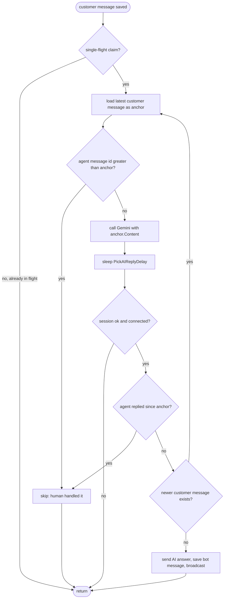

## Scope

All changes are in [`backend/internal/whatsapp/manager.go`](backend/internal/whatsapp/manager.go). No DB schema changes, no model changes, no frontend changes.

The two key facts the design relies on (already true in the code):

- The triggering customer `ChatMessage` is persisted **before** `go m.tryAutoReply(...)` is started (see `handleIncomingMessage` lines ~844–874).
- Outgoing human messages from the dashboard are saved with `SenderType = "agent"` (via `handlers/chat.go`'s `SendMessage`), and AI replies use `SenderType = "bot"`. So `latest_message_with_sender_type='agent'` is a reliable signal of "human took over".

## Design

### 1. Per-session single-flight (Manager-level)

Add to the `Manager` struct ([`manager.go` line 34](backend/internal/whatsapp/manager.go)):

```go
type Manager struct {
    // ...existing fields...
    autoReplyMu       sync.Mutex
    autoReplyInFlight map[uint]bool // sessionID -> true while a tryAutoReply goroutine owns this session
}
```

Initialize `autoReplyInFlight` in `NewManager`.

At the top of `tryAutoReply`, attempt to claim ownership:

```go
m.autoReplyMu.Lock()
if m.autoReplyInFlight[sessionID] {
    m.autoReplyMu.Unlock()
    // Another goroutine is already handling this session; it will see
    // our new customer message in its loop and re-think.
    return
}
m.autoReplyInFlight[sessionID] = true
m.autoReplyMu.Unlock()
defer func() {
    m.autoReplyMu.Lock()
    delete(m.autoReplyInFlight, sessionID)
    m.autoReplyMu.Unlock()
}()
```

This cleanly gives us "at most one AI reply being computed per chat at a time", which is the natural shape of the looping behaviour the user described.

### 2. Loop body inside `tryAutoReply`

Replace the linear body of `tryAutoReply` (currently lines ~941–1028) with this loop. The early checks (blacklist, KB exists, `AutoReplyEnabled`, `gemini.GlobalService != nil`) stay where they are, before the loop.

```go
const maxRethinkIterations = 5
for iter := 0; iter < maxRethinkIterations; iter++ {
    // Step A: capture the anchor — the latest customer message we'll respond to.
    var trigger models.ChatMessage
    if err := database.DB.
        Where("session_id = ? AND sender_type = ?", sessionID, "customer").
        Order("id DESC").
        First(&trigger).Error; err != nil {
        return // session has no customer message left (deleted, etc.)
    }

    // Step B: Feature 1 pre-check — if a human agent has already replied
    // after this customer message, drop out (no AI reply needed).
    if humanRepliedAfter(sessionID, trigger.ID) {
        log.Printf("AutoReply: human agent already replied in session %d, skipping AI", sessionID)
        return
    }

    // Step C: ask Gemini using the anchored question.
    answer, err := gemini.GlobalService.GetAnswerWithContext(entry.userID, trigger.Content, sessionID)
    if err != nil || answer == "" {
        return
    }

    // Step D: humanlike delay (existing PickAIReplyDelay).
    if delay := gemini.PickAIReplyDelay(); delay > 0 {
        time.Sleep(delay)
    }

    // Step E: post-delay session sanity (kept from existing code).
    var fresh models.ChatSession
    if err := database.DB.First(&fresh, sessionID).Error; err != nil || fresh.Status == "blacklisted" {
        return
    }
    if !entry.client.IsConnected() {
        return
    }

    // Step F: Feature 1 final check — human replied during our thinking/delay.
    if humanRepliedAfter(sessionID, trigger.ID) {
        log.Printf("AutoReply: human agent replied during AI think for session %d, dropping AI answer", sessionID)
        return
    }

    // Step G: Feature 2 — did a newer customer message arrive while we were thinking?
    var latestCustomerID uint
    database.DB.Model(&models.ChatMessage{}).
        Where("session_id = ? AND sender_type = ?", sessionID, "customer").
        Select("id").Order("id DESC").Limit(1).Scan(&latestCustomerID)
    if latestCustomerID != trigger.ID {
        log.Printf("AutoReply: customer sent newer message in session %d (anchor=%d, latest=%d), re-thinking",
            sessionID, trigger.ID, latestCustomerID)
        continue // loop: rebuild context and re-call Gemini
    }

    // Step H: stable context — apply existing "no answer" heuristic, send, persist, broadcast.
    lowerAnswer := strings.ToLower(answer)
    if strings.Contains(lowerAnswer, "sorry, i don't have an answer") ||
        strings.Contains(lowerAnswer, "connect you with a human") ||
        strings.Contains(lowerAnswer, "i don't have information") {
        return
    }

    // ...existing SendMessage + persist ChatMessage{SenderType:"bot"} +
    //    update ChatSession.last_message + broadcast.SessionMessage(...) ...
    return
}
log.Printf("AutoReply: hit max re-think iterations for session %d, giving up", sessionID)
```

### 3. New helper

Add a small helper in the same file:

```go
// humanRepliedAfter reports whether any agent message exists in this session
// with id strictly greater than the given customer message id.
func humanRepliedAfter(sessionID, customerMsgID uint) bool {
    var count int64
    database.DB.Model(&models.ChatMessage{}).
        Where("session_id = ? AND sender_type = ? AND id > ?", sessionID, "agent", customerMsgID).
        Count(&count)
    return count > 0
}
```

Using `id` instead of `created_at` avoids same-second tie-break ambiguity (auto-increment ID is monotonic per session within the same DB).

## Flow diagram



## Edge cases handled

- **Rapid-fire customer messages**: only the first goroutine claims the session; later goroutines exit immediately. The owner re-anchors and re-calls Gemini once per loop, so the eventually-sent reply is for the latest user message.
- **Human takeover mid-think**: caught by both the pre-Gemini and post-delay agent-message checks. AI answer is silently dropped.
- **Customer message + human reply in quick succession**: pre-check sees the agent message and bails before spending a Gemini call.
- **Runaway loop (user keeps typing forever)**: capped at `maxRethinkIterations = 5`. After that we log and exit; the next customer message triggers a fresh AI cycle.
- **`AcceptConversation` (assignment)**: not used as a gate — your description was strictly "somebody already replied", which is the agent-message check, not assignment.
- **`tryAutoReply` is no longer called with the trigger `content` parameter as the source of truth** — we re-derive the latest customer message from the DB on every loop iteration. The `question` parameter at the call site (`handleIncomingMessage` line 874, `handleIncomingMessageFB`) becomes redundant but can stay for logging; no signature change is required.

## Files changed

- [`backend/internal/whatsapp/manager.go`](backend/internal/whatsapp/manager.go)
  - `Manager` struct: add `autoReplyMu sync.Mutex` and `autoReplyInFlight map[uint]bool`.
  - `NewManager`: initialize `autoReplyInFlight`.
  - `tryAutoReply` (lines ~941–1028): wrap in single-flight, replace body with the iteration loop above.
  - Add `humanRepliedAfter` helper.

No other files need to change.